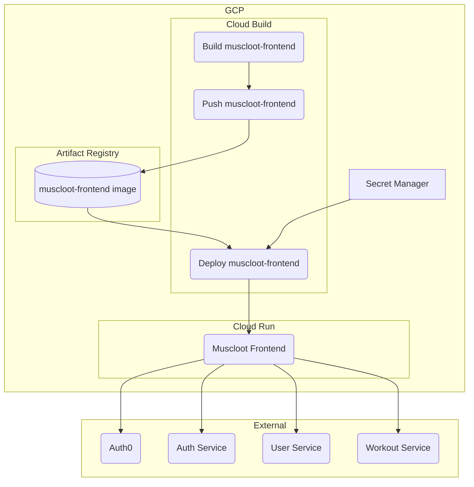

# Muscloot Frontend

[muscloot.qkitzero.xyz](https://muscloot.qkitzero.xyz)

```mermaid
flowchart TD
    subgraph gcp[GCP]
        secret_manager[Secret Manager]

        subgraph cloud_build[Cloud Build]
            build_muscloot_frontend(Build muscloot-frontend)
            push_muscloot_frontend(Push muscloot-frontend)
            deploy_muscloot_frontend(Deploy muscloot-frontend)
        end

        subgraph artifact_registry[Artifact Registry]
            muscloot_frontend_image[(muscloot-frontend image)]
        end

        subgraph cloud_run[Cloud Run]
            muscloot_frontend(Muscloot Frontend)
        end
    end

    subgraph external[External]
        auth0(Auth0)
        auth_service(Auth Service)
        user_service(User Service)
        workout_service(Workout Service)
    end

    build_muscloot_frontend --> push_muscloot_frontend --> muscloot_frontend_image

    muscloot_frontend_image --> deploy_muscloot_frontend --> muscloot_frontend

    secret_manager --> deploy_muscloot_frontend

    muscloot_frontend --> auth0
    muscloot_frontend --> auth_service
    muscloot_frontend --> user_service
    muscloot_frontend --> workout_service
```
